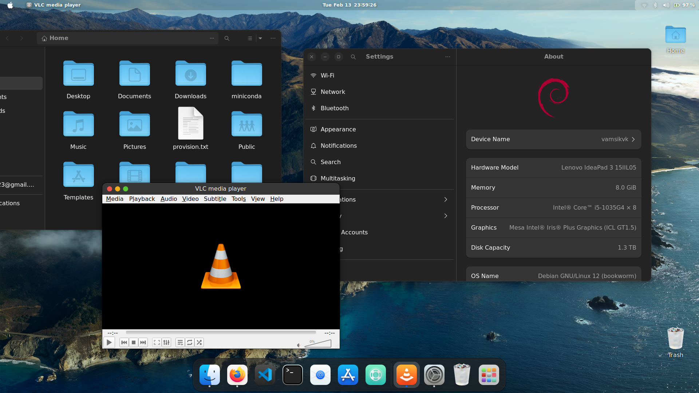

{: .mx-auto.d-block :}
This is how the final home screen looks like! Let's get started with the customization.

## 1. Theme

{: .mx-auto.d-block :}

### Install the theme

Run 
~~~ 
git clone https://github.com/vinceliuice/WhiteSur-gtk-theme.git --depth=1 
~~~

Run
~~~
./install.sh
~~~
to install the default whitesur theme 
