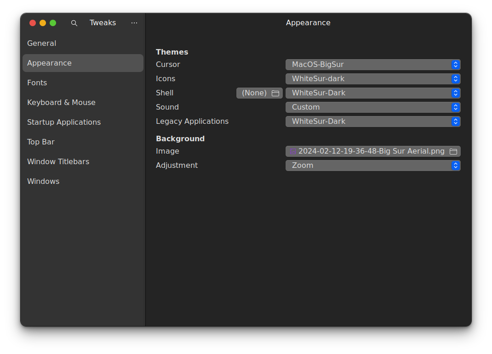

{: .mx-auto.d-block :}
This is how the final home screen looks like! Let's get started with the customization.


## 1. Theme

{: .mx-auto.d-block :}

### Install the theme

Run 
```
git clone https://github.com/vinceliuice/WhiteSur-gtk-theme.git --depth=1 
cd WhiteSur-gtk-theme
sudo ./install.sh
```

[Repository Link](https://github.com/vinceliuice/WhiteSur-gtk-theme.git)

This installs the default whitesur theme in our machine


## 2. Icons

{: .mx-auto.d-block :}

### Install the icons
Run 
```
git clone https://github.com/vinceliuice/WhiteSur-icon-theme
cd WhiteSur-icon-theme
sudo ./install.sh
```
[Repository Link](https://github.com/vinceliuice/WhiteSur-icon-theme)

## 3. Shell 

Download Link: [Big Sur Gnome Shell](https://www.gnome-look.org/p/1429633/)

1. Click on download button and click on any of the theme you like either dark or light
2. unzip and move that folder to /home/username/.themes

If you don't find .themes folder create it and then move the unzipped folder 

## 4. Cursor

{: .mx-auto.d-block :}


Download Link: [Gnome Apple Cursor](https://www.gnome-look.org/p/1408466/)

1. Download MacOS-BigSur.tar.gz file and extract it
2. Move the file and place it in /home/username/.icons

If you don't find .icons folder create it and then move the unzipped folder 


## 5. Dock

{: .mx-auto.d-block :}

Just enable this GNOME extension and customize it as you like - [Dash to Dock GNOME extension](https://extensions.gnome.org/extension/307/dash-to-dock/)

## 6. GNOME Extensions

These are some of the extensions which you need to install/enable

[1. Compiz alike magic lamp effect](https://extensions.gnome.org/extension/3740/compiz-alike-magic-lamp-effect/)  
[2. Compiz windows effect ](https://extensions.gnome.org/extension/3210/compiz-windows-effect/)  
[3. Coverflow Alt-Tab](https://extensions.gnome.org/extension/97/coverflow-alt-tab/)  
[4. Desktop Icons NG (DING) ](https://extensions.gnome.org/extension/2087/desktop-icons-ng-ding/)  
[5. Just Perfection ](https://extensions.gnome.org/extension/3843/just-perfection/)  
[6. Search Light](https://extensions.gnome.org/extension/5489/search-light/)  

Know what these extensions do and then install them 

## 7. Wallpapers

Here is the Google drive link for all kinds of Apple wallpapers - [Apple Wallpapers](https://drive.google.com/drive/folders/1qutMH7gUl3pwZzXC23Alfgj88gkndus-?usp=drive_link)

## 8. Enabling The Final Theme

Open Tweaks application and adjust the appearance and Window title bar settings as shown( you may select light or dark theme as per your preferences)

{: .mx-auto.d-block :}

{: .mx-auto.d-block :}

If you want your font style also to be changed, here is the link - [Fonts](https://www.download-free-fonts.com/category/san-francisco-fonts)

Download them and change the font in Tweaks app

### This is how I have customized my Debian Linux machine theme to MacOS theme


